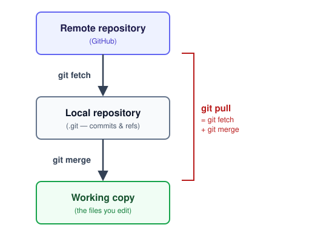
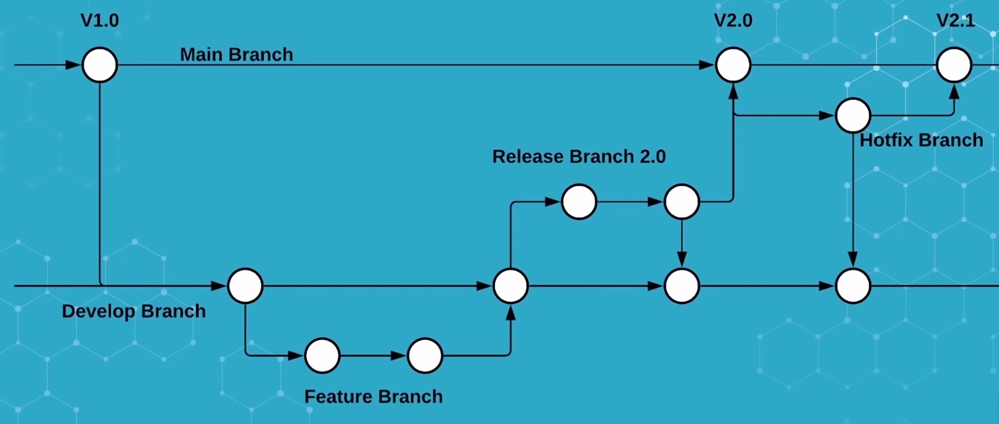
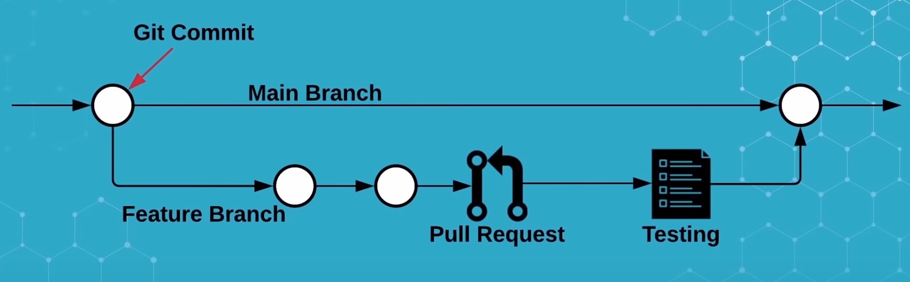
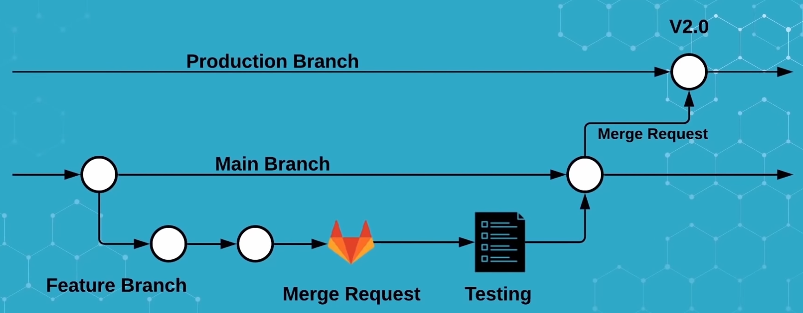
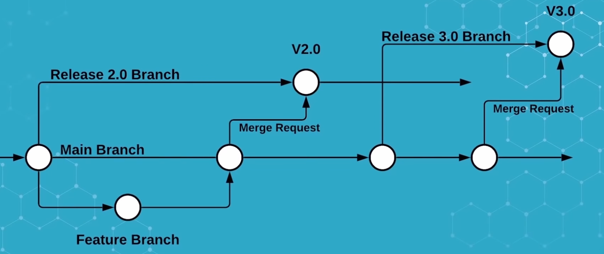

# 1. Software Development Basics — Git & GitHub

Session 1 · 60 min · lecture + live demo only (no lab time — see
"Exercises" note at the bottom)

## Prerequisites

* Git installed: https://git-scm.com/book/en/v2/Getting-Started-Installing-Git
* A GitHub account, with either an SSH key or a Personal Access Token set up
* Check it works:
  ```sh
  $ ssh -T git@github.com
  Hi <you>! You've successfully authenticated...
  ```

## Objectives

* Use Git locally and with a remote
* Understand *why* some Git operations are risky, not just *that* they are
* Know how GitHub's collaborative workflow works: issues, forks, pull
  requests, review

By the end of this session you won't have written any project code yet —
the rest of today is lecture + demo (environment control, then workflow
control and docs/testing), and actual hands-on work on the data challenge
starts once you fork the shared repo at today's tag-up. What you *will*
have by the end of this session is everything you need to commit,
branch, and collaborate through GitHub once you do.

## Some sources

* Best git teaching I know thanks to [ARAMIS](https://aramis.resinfo.org):
  * [David Parsons slides](https://parsons.eu/git/introduction/slides.pdf)
  * Also see his very complete [tutorial](https://parsons.eu/git/introduction/hands-on.pdf)

## Version control, briefly

### Why version control

[](https://assets.datamation.com/uploads/2020/12/tech-comics-version-control_5fcf02a527b83.jpeg)

Good old days when we were using floppy disks to save our work...

### Local version control

<br/>

- "database" of changes
- Now how to share it ?

### Centralized version control

<br/>

- A central server storing the "database"
- Clients can checkout files from the server
- CVS, Subversion ...
- What if the server is down ?


### Distributed version control

<br/>

- Every client has a full copy of the "database"
- Clients can work offline
- Clients can share changes with each other
- Git, Mercurial ...


## Git basics

### The three states

<br/>

* **Working directory** — the files you're editing
* **Staging area** (the "index") — what will go into the *next* commit
* **Repository** (`.git/`) — every commit ever made

`git add` moves changes from working directory → staging area.
`git commit` moves staged changes → repository, permanently (well —
see "Rewriting history" below for what "permanently" really means).

### File Status Lifecycle

[](https://git-scm.com/book/en/v2/images/lifecycle.png)

### Everyday commands

```sh
git init                  # start a new repo
git status                # what's changed, what's staged
git add <path>            # stage a change
git commit -m "message"   # record staged changes
git log --oneline         # history
git diff                  # unstaged changes
git diff --staged         # staged changes
```

### Branches

* A branch is just a movable pointer to a commit
* Cheap to create, cheap to switch — this is what makes parallel,
  independent work possible

```sh
git branch feature-x      # create
git switch feature-x      # move to it (older: git checkout feature-x)
git switch -c feature-y   # create + move in one step
```

#### Create a branch

```sh
$ git branch testing
```

[](https://git-scm.com/book/en/v2/images/head-to-master.png)


#### Checkout a branch

```sh
$ git switch testing
```

[](https://git-scm.com/book/en/v2/images/head-to-testing.png)

Make a change, stage it, and commit it:

```
$ git commit -a -m "made a change"
```

[](https://git-scm.com/book/en/v2/images/advance-master.png)

### Merging branches

[](https://git-scm.com/book/en/v2/images/basic-branching-6.png)

```sh
git switch master
git merge iss53
```

[](https://git-scm.com/book/en/v2/images/basic-merging-2.png)

### Merging and conflicts

* Merging replays one branch's changes onto another
* If two branches changed the *same lines* of the *same file*, Git can't
  guess which one you want — that's a **conflict**, and you resolve it
  by hand:
  ```
  <<<<<<< HEAD
  what you have
  =======
  what the other branch has
  >>>>>>> other-branch
  ```
  Edit to what it *should* say, remove the markers, `git add`, `git commit`.
* Fewer, smaller conflicts come from: committing often, pulling often,
  short-lived branches, and pull requests (more on those below) — this
  is exactly the situation the Day 2 data-challenge merge session is
  designed to put you in on purpose.

### Rebasing

* Rebasing is an alternative to merging: instead of combining two
  branches, it "replays" one branch's commits on top of another
* pro: keeps history linear, avoids merge commits
* con: rewriting history — if you've already pushed, rebasing is risky

[](https://git-scm.com/book/en/v2/images/basic-rebase-1.png)

```sh
git checkout experiment
git rebase master
```

[](https://git-scm.com/book/en/v2/images/basic-rebase-3.png)

```sh
git checkout master
git merge experiment
```

[](https://git-scm.com/book/en/v2/images/basic-rebase-4.png)

### Remotes: push and pull

* A remote is just another copy of the repo (on GitHub, in our case)
* `git push` sends your commits there; `git pull` brings theirs to you
* Nothing is shared automatically — you decide when to sync
* `git fetch` and `git pull` are not the same thing:

[](./img/fetch-merge-pull-push.svg)

* **`git fetch`** downloads what's new on the remote into your *local*
  repository — your working copy doesn't change yet
* **`git merge`** combines that into your working copy (this is the
  same merge as any other — can conflict, same resolution as above)
* **`git pull`** does both in one command — convenient, but it means a
  conflict can show up without a separate "download" step to warn you
* **`git push`** is the only one going the other direction

  (for the curious: what `git fetch` actually moves locally is a
  *remote-tracking branch*, `origin/main` — a read-only bookmark for
  "where GitHub's `main` was as of my last fetch." `git merge
  origin/main` is the precise version of the "merge" step above.)

```sh
git remote -v             # see what remotes you have
git remote add origin <url> # add a remote repo if needed
git push -u origin main
git pull
```

### Other useful commands

```sh
git reset <path>          # unstage a file
git restore <path>        # discard unstaged changes
git reset <commit> --hard # discard all changes since <commit>
git clone <url>           # copy a remote repo locally
```

## Rewriting history

### Why, and why it's risky

You'll want to rewrite history to fix a mistake, or clean up a messy
sequence of "wip", "fix typo", "oops" commits before merging. Two tools:

```sh
git commit --amend      # fix the most recent commit
git rebase -i HEAD~3    # rewrite the last 3 commits interactively
```

**Rule of thumb: only rewrite history nobody else has fetched yet.**
Once you've pushed, or someone's pulled your branch, rewriting it means
your history and theirs no longer agree — Git will refuse to push
normally (you'd need `--force`), and *their* copy still has the old
commits regardless of what you do to yours.

### Demo: the mistake we actually made building this course

While preparing the data-challenge repo, we generated 5 sample data files
and committed them straight into the seed commit, alongside real code.
Committing generated/binary files is bad practice — they bloat the repo,
they're not diffable, and here they were fully regenerable from a script
we'd *also* committed. Worth fixing, and a good excuse to show what
"remove a file from Git" actually means at each of the three states above.

Follow along — this is a real repo, do this in a scratch folder:

```sh
mkdir git-history-demo && cd git-history-demo
git init -b main
echo "# Demo" > README.md
git add README.md && git commit -m "Initial commit"

# simulate the mistake: a real file + a "generated" one, same commit
printf 'def total(rows):\n    return sum(int(v) for _, v in rows)\n' > analyze.py
awk 'BEGIN{print "id,value"; for(i=0;i<1000;i++) print i","i*i}' > report.csv
git add analyze.py report.csv
git commit -m "Add analysis script and report"
```

**Step 1 — plain `rm`**: only changes the working directory.

```sh
rm report.csv
git status                # "deleted: report.csv" — unstaged
```

**Step 2 — `git rm`**: stages the deletion. Committing it makes the file
disappear from `HEAD` and the working directory — but *not* from history:

```sh
git rm report.csv
git commit -m "Remove report.csv"

git log --oneline -- report.csv       # both commits still show up
git show <add-commit-sha>:report.csv | head   # ...and it's still readable
```

This is the part people get wrong: "I deleted it and committed" does not
mean "it's gone." It means "it's gone *from now on*," which is different.

**Step 3 — interactive rebase**: to actually remove it from history, you
have to rewrite the commit that introduced it.

```sh
git rebase -i --root
# in the editor, change "pick" to "edit" on the "Add analysis script
# and report" line, save and close

git rm report.csv
git commit --amend --no-edit
git rebase --continue

git log --all --oneline -- report.csv     # nothing — truly gone now
```

(The follow-up "Remove report.csv" commit becomes empty once the file
never existed upstream of it, and gets dropped automatically.)

**The catch**: this only works cleanly because nobody has fetched our
mistake yet. Fixing it for real means pushing with
`git push --force-with-lease` — and if anyone had already pulled that
commit, their copy would still have the file no matter what we did to
ours. That's the whole reason for the "don't rewrite shared history" rule
above: it's not that it's impossible, it's that it doesn't undo what
other people already have.

**Live**: the data-challenge repo, right now, still has this exact
mistake — the 5 `.npy` files are still sitting in its seed commit. Let's
fix it for real, on the real repo, with the same three steps. One
wrinkle: there, the offending commit *is* the tip (`HEAD`) — nothing was
committed after it yet — so it doesn't even need a rebase: `git rm
data/frames/*.npy && git commit --amend --no-edit` rewrites that one
commit directly. Recognizing "this is just HEAD, amend is enough" vs.
"this is buried a few commits back, I need `rebase -i`" is itself the
point.

### `.gitignore`: preventing this next time

Fixing it after the fact works, but is more work than not committing it
in the first place. `.gitignore` lists patterns Git should never stage —
`git add -A`, `git status`, everything just skips them:

```
# .gitignore
__pycache__/
*.pyc
.venv/
data/frames/          # generated, not source — regenerate, don't commit
.env
*.pem
*_token
credentials.json
```

Two things worth knowing that aren't obvious from the name:

* **`.gitignore` only affects *untracked* files.** If a file is already
  committed, adding it to `.gitignore` does nothing until you also
  `git rm --cached <path>` once, to actually untrack it — from then on
  the ignore rule keeps it out.
* **It's not a security boundary.** If a password or API token gets
  committed, `.gitignore`-ing it afterward, or even rewriting history
  like we just did, does *not* make the leak safe — anyone who already
  cloned or forked still has it, and it may already be cached by GitHub
  or search indexes. The actual fix for a leaked credential is to
  **revoke/rotate it**, treating it as compromised, *in addition to*
  cleaning up history. Secrets belong in environment variables or a
  secrets manager (GitHub Actions has its own — more in the CI/CD
  session), never in a commit.


## GitHub

### What it adds on top of Git

* Git is the version control system; GitHub is where you host repos and
  collaborate around them
* Issue tracking, pull requests + code review, Actions (CI/CD), Pages,
  Container Registry — all the pieces this course uses

### Terminology

* **Repository** — a project's Git history, hosted on GitHub
* **Fork** — your own copy of someone else's repository, on your account
* **Issue** — tracks a piece of work: a bug, a task, a question
* **Pull request (PR)** — "please merge this branch into that one" —
  the place where a change gets discussed, reviewed, and eventually merged
* **Review** — line comments, a change request, or an approval on a PR

### Roles: developer, reviewer, maintainer

GitHub actually has five permission levels on a repo: Read < **Triage** <
**Write** < **Maintain** < Admin. This course uses three of them as three
named roles — not a simplification, the real levels, just with names
that say what the job is:

* **Developer** (`Write`) — pushes branches, opens PRs, does the actual
  coding. Most people on a team are developers.
* **Reviewer** (`Triage`) — reviews PRs: comments, requests changes,
  approves; can also manage issues and PR labels/assignees. *Cannot*
  push code or merge — a reviewer's job is to look, not to touch.
* **Maintainer** (`Maintain`) — merges approved PRs into the shared
  branch, manages branch protection. The gatekeeper for what actually
  lands on `main`.

Everyone will play more than one of these roles over the two days — the
same person can be a developer on their own team's branch and a
reviewer on someone else's PR. Who's maintainer for the shared upstream
repo specifically gets decided for real at the Day 1 tag-up — see
`5-data-challenge/README.md`.

###  Most common Git branching strategies

* Gitflow (the most complex)



* Github flow (the simplest)



* Gitlab flow (the most common?)



* Gitlab flow alternative


#### The workflow this course uses: GitHub flow

* `main` is always deployable
* Every change happens on a short-lived branch off `main`
* Open a PR early — it's where discussion happens, not just a final
  approval gate
* Review, address feedback, merge, delete the branch

This is deliberately the simplest of the common branching strategies
(compare Gitflow's multiple long-lived branches, or GitLab flow's
staged environment branches) — simple enough to run with a repo you've
never seen before, which is exactly the situation at today's tag-up when
the data challenge repo shows up for the first time.

### Fork → branch → PR, for this course specifically

For the data challenge, every team forks the shared upstream repo and
works inside their fork however they like — but integrating back to
upstream always happens through a pull request from that fork. More on
this in `5-data-challenge/README.md`.

## Going further

* Best git teaching I know : [David Parsons support](https://parsons.eu/git/)
  * In particular in the advanced git section, the "Git internals" : https://parsons.eu/git/advanced/presentation/git-internals/outline.md
* git documentation: https://git-scm.com/doc
* GitHub documentation: https://docs.github.com/en
* Another good software management platform is GitLab: https://docs.gitlab.com
* GitLab vs GitHub comparison (gitlab point of view): https://about.gitlab.com/compare/gitlab-vs-github/
* GitLab vs GitHub comparison (github point of view): https://github.com/resources/articles/devops-tools-comparison