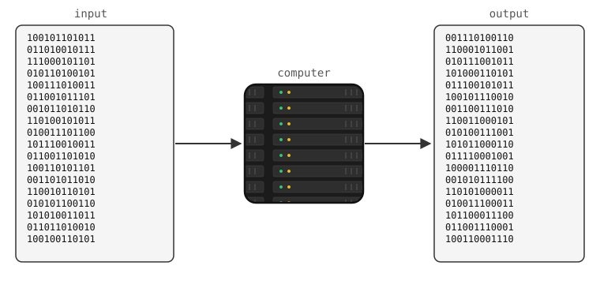
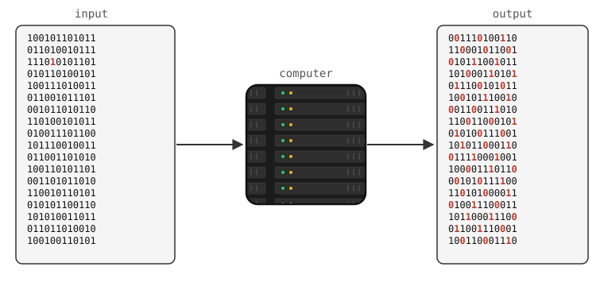
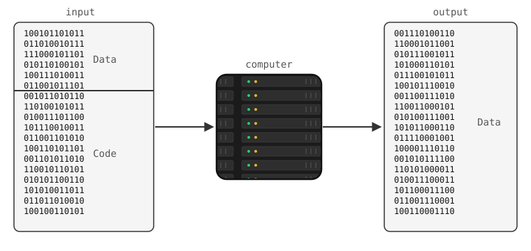
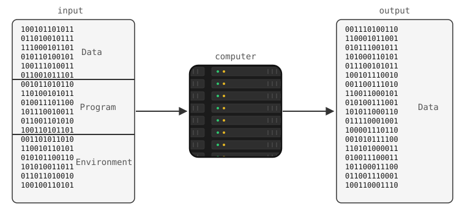
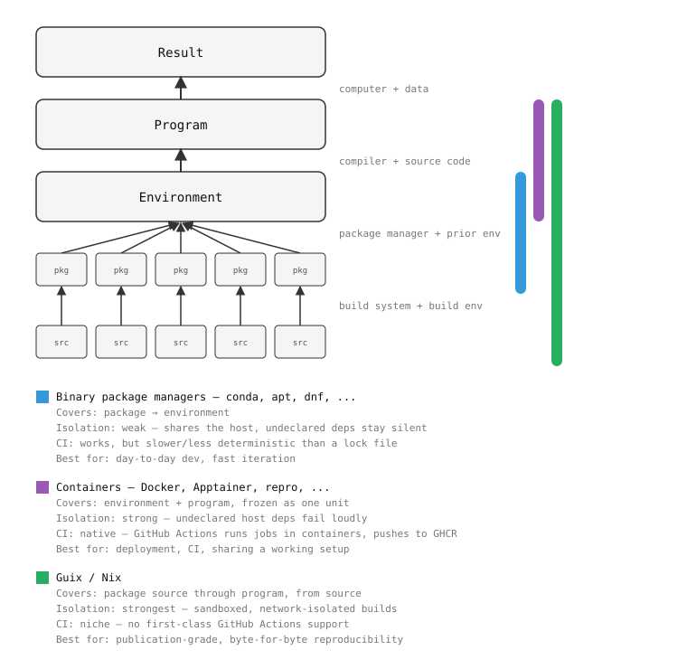

# 2. Environment Control — Conda & Docker

Session 2 · 90 min · lecture + live demo only (no dedicated exercise slot —
see "Exercises" at the bottom)

## Prerequisites

* [Miniforge](https://github.com/conda-forge/miniforge) installed
  (Conda-Forge's community distribution — not Anaconda, see below)
* [Docker](https://docs.docker.com/get-docker/) installed, `docker run hello-world` works
* A local clone of the shared data-challenge repo (read-only for now —
  forking it is today's tag-up, later this session):
  ```sh
  git clone git@github.com:jzoubian/software-development_data-challenge.git
  ```

## Objectives

* Explain *why* "it works on my machine" happens, and the reproducibility
  vs. replicability distinction
* Create, export, and recreate a Conda/Miniforge environment
* Build and run a Docker image for the same code
* Know which tool to reach for, and when neither is enough

## Environments and reproducibility

Full talk: Konrad Hinsen's [seminar on reproducibility](https://indico.in2p3.fr/event/23374/)

### What's reproducibility?

* **Experimental reproducibility** — re-do an experiment, get
  sufficiently close results
* **Statistical reproducibility** — re-do a study with a different
  sample, get sufficiently close results
* **Computational reproducibility** — re-do a computation (data
  analysis, simulation, ...), get *identical* results — this is the one
  this session is about

### Reproducibility vs. replicability

* **Reproducibility**: same code, same environment, same result
* **Replicability**: same code, *a* similar environment, a consistent
  result — usually what you actually need, and easier to get

| | Reproducibility | Replicability |
|---|---|---|
| Nature | Technical | Scientific |
| Question | Done right? | The right thing to do? |
| Answer | Straightforward — yes/no | Difficult to judge — it depends... |
| Role | Verification | Validation |
| In computing terms | Same software + same parameters + same data → identical result? | New software + same parameters + same data (or not) → equivalent result? |

* There's a cost to reproducibility — match the effort to what the result
  is for (a scratch notebook vs. a published analysis are not the same
  bar)

### What's a computation, really?

Konrad Hinsen's framing (full talk linked below) — build this up live,
this is the condensed version.

<br/>

* A computation is a mapping from input bits to output bits — "meaning"
  is a human overlay on top, not something the computer knows about

<br/>

* Nothing here is smooth or intuitive — a 1-bit change in the input can
  cause an outsized change in the output. "I used the same code" is not
  the same claim as "I got the same result"

<br/>

* Split the input side in two: what varies run to run is **data**, what
  should stay fixed is **code** — but code is just more bits going into
  the same box, nothing structurally different about it

<br/>

* There's a third, usually invisible, input: the **environment** the
  program runs in (interpreter, libraries, OS, hardware) — this input is
  the whole reason this session exists

### Whose problem is which layer?

| | data | program | environment |
|---|---|---|---|
| Scientist's view | my research | my colleagues' code | stuff I don't care about |
| Software engineer's view | my colleagues' data | my code | stuff I don't care about |
| What's actually true | zeros and ones | an interpretation of the data | an interpretation of the program |

* Everyone treats someone else's layer as "not their problem" — managing
  environments is making that explicit instead of leaving it assumed
* There's no privileged layer that's "just the data" without a program to
  read it, or "just the program" without an environment to run it — it's
  interpretation stacked on interpretation, all the way down

### How to manage environments ?

<br/>

Neither tool alone gets you all the way to bitwise-identical results —
each buys a different amount of reproducibility for a different cost:

| Tool | Reproducibility | Replicability | Isolation | CI fit | Best for |
|---|---|---|---|---|---|
| Conda | Limited (resolver can drift) | Good enough | Weak — shares the host, undeclared deps stay silent | OK — works, but slower/less deterministic than a lock file | Day-to-day dev, prototyping |
| Conda + `conda-lock` | Better (hashes, pinned) | Good | Weak — same as Conda | Good — lock file skips solving, fast and deterministic | Shared dev environments |
| Docker | High, if base image is pinned | More limited than expected | Strong — undeclared host deps fail loudly | Best — GitHub Actions runs jobs in containers, pushes straight to GHCR | Deployment, CI |
| Guix/Nix | Bitwise exact | Exact, but heavyweight | Strongest — sandboxed, network-isolated builds | Niche — no first-class GitHub Actions support | Publication-grade research |

* **Isolation isn't just a reproducibility nicety — it's what forces
  undeclared dependencies to surface, and it's a security boundary.** A
  Conda environment shares your user account's filesystem and network
  access; a stray `import` that happens to work because of something
  else installed on your laptop won't fail until someone else tries it. A
  container's isolation is exactly why it's also the default choice for
  running untrusted code in CI.
* Docker is also the natural fit for *this course's* CI workflow —
  Session 4 automates this exact build with GitHub Actions and pushes
  the result to GHCR, so it's very likely the tool you'll actually touch
  again this week.

Guix/Nix build everything from source, declaratively, including the
compiler — the "ultimate" end of this spectrum. Worth knowing it exists;
steep learning curve, smaller ecosystem, out of scope for this course.
**Do you actually need bitwise reproducibility, or is replicability
enough?** — usually the second.

### Conda / Miniforge

* Package *and* environment manager — not Python-only, any language
* Packages come from **channels**; `conda-forge` is the community one
* ⚠️ **Anaconda's `defaults` channel is under a commercial license** —
  many institutions (labs, universities) now restrict its use. Use
  `conda-forge` instead — that's what "Miniforge" ships with by default.

```sh
conda create -n myenv python=3.11 numpy pandas   # create (+ packages)
conda activate myenv                             # activate
conda install matplotlib                         # add a package
conda env export --no-builds > environment.yml   # share it (portable)
conda env create -f environment.yml -n myenv2    # recreate it elsewhere
conda env remove -n myenv                        # clean up
```

* `--no-builds` drops platform-specific build hashes — without it, your
  environment file only reproduces on the *same OS + architecture* you
  exported from
* `--from-history` goes further: only what you explicitly asked for, not
  the resolved dependency tree — most readable, least reproducible

**Spot the problem** — a real environment file, lightly disguised:

```yaml
channels: [defaults]
dependencies:
  - python=3.7
  - numpy=1.18.5
  - pandas=1.0.5
  - pip:
      - scikit-learn==0.22
```

`defaults` channel (license), everything hard-pinned to a single old
version (no security updates, brittle), `scikit-learn` pulled from pip
when conda-forge has it too (two package managers now need to agree).
Fix: `conda-forge` channel, version *ranges* (`python>=3.10,<3.13`), let
conda resolve what it can.

* For byte-for-byte reproducibility across machines, `conda-lock`
  generates a full lock file (exact versions + hashes, per platform) —
  one step further than a plain `environment.yml`, at the cost of
  needing to re-lock whenever you change a dependency.

### Containers: Docker

* A container packages the OS libraries *and* the code together — a
  level below what Conda covers (Conda still relies on the host kernel
  and some system libraries)
* **Isolation** + **portability**: the same image runs identically on
  your laptop, a CI runner, or a server
* Not magic reproducibility either: a base image (`python:3.11-slim`)
  can itself change over time unless you pin a digest

```sh
docker pull python:3.11-slim              # fetch a base image
docker run --rm python:3.11-slim python -V   # run it, throwaway
docker run --rm -v "$PWD":/work -w /work python:3.11-slim \
    python script.py                      # bind-mount your code in
```

A `Dockerfile` bakes the setup into a reusable image instead of typing
flags every time:

```dockerfile
FROM python:3.11-slim
RUN pip install numpy matplotlib
COPY . /app
WORKDIR /app
CMD ["python", "-m", "astrolab.pipeline"]
```

```sh
docker build -t astrolab .
docker run --rm astrolab
```

Pushing this image to a registry (GitHub Container Registry) so it's
built once and reused everywhere — including automatically, on every
push — is where this picks back up in Session 4 (GitHub Actions).

## Demo

Live, against the data-challenge repo you cloned above.

**1. An ad hoc environment, the problem it has:**

```sh
conda create -n astrolab python=3.11 numpy matplotlib -y
conda activate astrolab
cd software-development_data-challenge
python -m astrolab.pipeline
```

Loads the 5 sample frames, then stops at
`NotImplementedError: stack_frames: implement frame stacking` — expected,
that's backlog work for later. The point here: this environment only
exists on this machine, right now, in nobody else's history.

**2. Make it shareable:**

```sh
conda env export --no-builds > /tmp/environment.yml
cat /tmp/environment.yml
```

Notice everything `numpy`/`matplotlib` pulled in transitively that we
never typed. (We're not committing this yet — that's exercise 1 below,
someone still has to decide *how* it's pinned.)

**3. Same thing, containerized:**

```sh
cat > Dockerfile <<'EOF'
FROM python:3.11-slim
RUN pip install numpy matplotlib
COPY . /app
WORKDIR /app
CMD ["python", "-m", "astrolab.pipeline"]
EOF
docker build -t astrolab-demo .
docker run --rm astrolab-demo
```

Same `NotImplementedError`, same code — but this time it'll run
identically on any machine with Docker, no local Python setup at all.

## Exercises

Backlog tasks for tonight's evening work (claimed at today's tag-up, see
`5-data-challenge/README.md`). Each is independent — pick either or both.

* **Add a Conda/Miniforge `environment.yml` for the data-challenge repo.**
  It currently has none (the demo above worked around that). Pin with
  version *ranges*, not exact pins; use `conda-forge`, not `defaults`;
  update `README.md`'s Quickstart to `conda env create -f environment.yml`
  instead of the current `pip install numpy matplotlib`. Split within the
  team: one person drafts the core deps (`numpy`, `matplotlib`, `pandas`
  — check what `astrolab/pipeline.py` actually imports), another handles
  the optional `astroquery` extra needed by the `realdata` bonus feature
  without forcing it on everyone, a third tests the file from scratch on
  a clean machine/VM and fixes what's missing.
* **Add a `Dockerfile` for the data-challenge repo**, building on today's
  demo: install deps, copy the code, run the pipeline by default. Split
  within the team: one person gets a minimal image building and running
  correctly, another sizes/optimizes it (e.g. `--no-cache-dir`, slim base,
  layer ordering so deps cache separately from code changes), a third
  documents the `docker build`/`docker run` usage in `README.md`.
