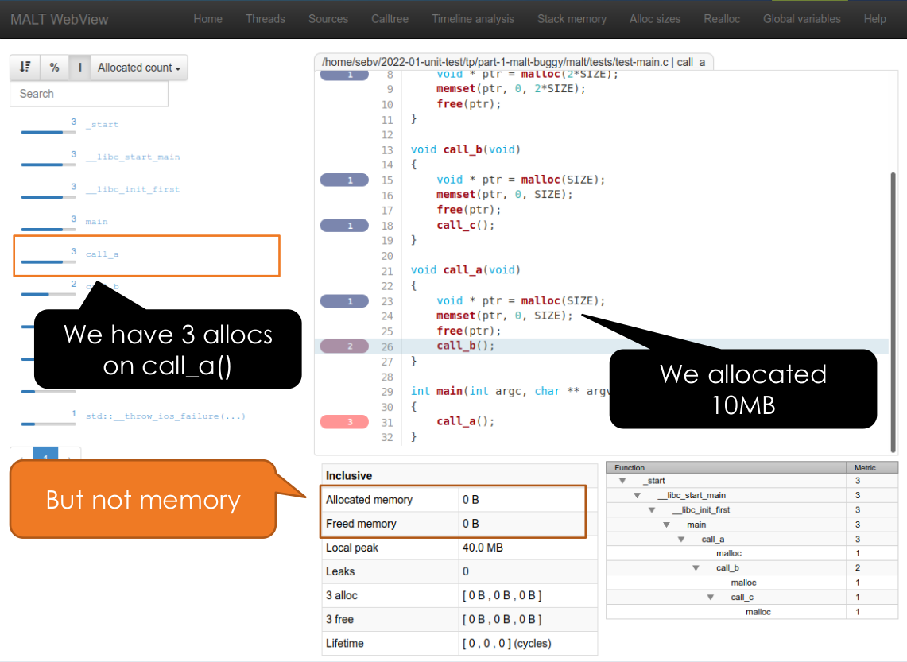

# 3. Documentation & Testing

Session 3 · 90 min (30 min docs + 60 min testing, right after the Copilot
snap talk) · lecture + live demo only (no dedicated exercise slot — see
"Exercises" at the bottom)

## Prerequisites

* A local clone of the data-challenge repo (from Session 2):
  ```sh
  git clone git@github.com:jzoubian/software-development_data-challenge.git
  ```
* Python environment with `pytest` and `pdoc` (reuse Session 2's `astrolab`
  conda env and add both: `conda activate astrolab && conda install pytest pdoc -y`)
* This module's standalone demo files, `3-documentation-testing/demo/`, from
  your clone of *this* course repo (not the data-challenge repo) — copy the
  `particle/` and `cache-mock/` folders somewhere you can edit freely

## Objectives

* Explain *technical debt* well enough to recognize it, not just avoid it
* Turn docstrings into both documentation *and* tests (`doctest`), and
  generate an API doc site from them
* Know the unit/functional/regression/integration vocabulary
* Write a first unit test, and mock a dependency by hand and with
  `unittest.mock`

## Sources

Most of this session's is inspired by Sébastien Valat's seminar [*Unit testing to improve the life of software developers and scientists*](https://indico.in2p3.fr/event/25857/) and the practical workshop that followed it, [`tp_unit_test_260122`](https://gitlab.in2p3.fr/CPPM_TP_CALCUL/tp_unit_test_260122).

## Technical debt

[](https://cdn.aboutwayfair.com/9f/98/3bbe727a42ae9eb6dea4fea70207/techdebtcartoon.png)

Four flavors of the same house falling apart:

* **Code debt** — copy-pasted logic instead of a shared function; one bug fix now needs applying in N places
* **Design debt** — hardcoded paths/thresholds instead of config; breaks the moment it runs somewhere else
* **Testing debt** — no tests; a change silently breaks old behavior, nobody notices until a user does
* **Documentation debt** — nothing explains the weird input format or directory layout; future-you (or a teammate) loses an afternoon

Code and design debt get paid down by review and refactoring — but refactoring *without tests* is just changing things and hoping. **Testing and documentation debt are what today is about**, because they're the two kinds of debt that make *every other kind* safe to pay down:
* Tests turn "I refactored this, I think it still works" into "I refactored this, and the suite proves it still works" — refactoring becomes routine instead of terrifying
* Documentation turns "why does this code do that?" from an archaeology project into a five-second lookup — for future-you as much as for a teammate

## Why test early

[](https://www.codecaptain.cc/assets/img/article/20230727/2023072702.png)

Capers Jones, *Applied Software Measurement* (1996) — three curves over Coding → Unit Test → System Test → End Test → Production:

* 🔵 **defects introduced** — peaks during coding, then drops off
* 🟨 **defects found** — low during coding, peaks during system/end test
* 🔴 **cost to repair** — near zero, then climbs continuously

The argument is the gap between the blue curve and the red one: most bugs are written early, but they're also cheapest to fix early. 

The same typo in a formula costs:
- a minute to fix in code review; found by a unit test a day later
- an hour; found in system testing
- hours of tracing through components that were built on top of it in the meantime; found in production, an emergency release plus whatever it cost the user who hit
it.

Nothing about the bug changed — only how much got built on top of it before anyone noticed.

## Docs and tests are two halves of the same idea

* **You write the specification you want** — what a function should do, for which inputs, with which edge cases — that's the docstring
* **You write a test to validate the specification** — code that checks the function actually behaves that way — that's the unit test
* `doctest` (next section) is the extreme case: the same lines *are* the spec and the check, so they can't drift apart
* Neither substitutes for the other: a docstring with no test can go silently wrong the next time someone edits the function; a test suite with no docs forces every reader to reverse-engineer *intent* from a pile of assertions
* That's why this session bundles both — they're the same underlying discipline (say precisely what the code should do), applied twice: once for humans to read, once for a machine to check

## Developer documentation: docstrings → doctest → API docs

* Write the docstring **as you write the function** (or before) — what it
  does, its parameters, its return value, its edge cases
* Python convention: put runnable **examples** in the docstring —
  `doctest` then checks them automatically, so the example can't silently
  go stale

```python
def factorial(n):
    """Return the factorial of n, an exact non-negative integer.

    >>> [factorial(n) for n in range(5)]
    [1, 1, 2, 6, 24]
    >>> factorial(-1)
    Traceback (most recent call last):
        ...
    ValueError: n must be >= 0
    """
    if n < 0:
        raise ValueError("n must be >= 0")
    result = 1
    for factor in range(2, n + 1):
        result *= factor
    return result
```

* This is **executable documentation**: the example in the docstring *is*
  the test. If the behavior changes and nobody updates the docstring, the
  test fails — the docs can't quietly drift from the code
* Once every public function/class has a docstring, generate a browsable
  API doc site straight from them:

  | Tool | Setup | Fits |
  |---|---|---|
  | **pdoc** | zero-config, one command | small/medium projects, fast to demo — today's pick |
  | **mkdocstrings** | needs an MkDocs site | you already want a hand-written docs site (guides, tutorials) around the API reference |
  | Sphinx | most config, most powerful | large/mature projects, the historical default |

## User documentation: the README

Every project's entry point, for users *and* future-you. At minimum:

* **What & why** — what the code does, what problem it solves
* **Setup** — how to install/build (Session 2: `environment.yml`/`Dockerfile`)
* **Usage** — copy-pasteable commands, example input/output
* **Contributing** — how to run tests, format code, the branch/PR workflow
  (Session 1)
* **Reporting issues** & **license**

The data-challenge repo's `README.md` already has the first two — it's
missing the rest, on purpose (backlog below).


## Testing vocabulary

| Type | Checks | Example |
|---|---|---|
| **Unit test** | one function/small piece of code, in isolation | `add(2, 3) == 5` |
| **Integration test** | multiple components working together | API call reaches the database and back |
| **Functional test** | a full feature/scenario | load data → train → check accuracy |
| **Regression test** | a bug, once fixed, stays fixed | add a test the moment you fix the bug |

Unit tests specifically: fast (milliseconds), precise (pinpoint *which*
function broke), and they document what the code is *supposed* to do —
tests are also documentation. Python frameworks: `unittest` (stdlib,
simple), `pytest` (richer — fixtures, parametrization, plugins — today's
pick), `doctest` (above), `hypothesis` (property-based, generates inputs —
worth knowing exists).

> "If it's not tested, it's broken — you just don't know it yet."

## Unit tests are more than testing

Bugs caught are the visible payoff — the underestimated ones show up elsewhere:

* **Forces you to think through your internal design** — to call your own API from a test, you first have to design one; awkward-to-test code is usually just awkward code
* **Forces a spec for internal APIs** nobody would otherwise bother writing down
* **Opens an easy door to refactor or rewrite** — a green suite is permission to change the internals without re-litigating "does this still work?" from scratch
* **New developers gain confidence faster** — including *you*, in a year, or an intern touching code they didn't write
* **If a test gets too complicated, that's a signal, not a chore** — stop and refactor the code under test to be simpler and more testable; hard to test usually means the design is doing too much
* **Encodes knowledge of corner cases already fought through** — the next person (including future-you) doesn't have to rediscover them by breaking things again
* **Outlives the implementation** — a test suite is a spec you can carry into a full rewrite, even in a different language; the algorithm's behavior survives even when none of the code does

Writing code without testing it is no engineering, it's just writing code.

## Conclusion: write them, but write them well

* **Modern code assistants remove the last excuse.** Copilot (today's
  snap talk, just before this session) drafts a docstring from your
  function, or a first-pass test from your docstring, in seconds — "no
  time to document/test" stops being a credible reason
* **AI output is a draft, not a verdict — review it like a teammate's
  PR.** A generated docstring or test is a claim about what the code
  does, not proof. Read it against the code's actual behavior, including
  edge cases, before trusting it — a plausible docstring or test that
  describes the *wrong* behavior is worse than none
* **Documentation has a specific reader — write for them, not for
  yourself:**
  * A docstring's reader is another developer (often future-you) calling
    this function: parameters, return value, exceptions, edge cases
  * A README's reader often hasn't opened the code at all: what problem
    this solves and how to run it — not internals
* **A test that runs is not a test that tests.** This passes, and checks
  nothing:

  ```python
  def test_elastic_collision(self):
      p1, p2 = Particle(0.0, 1.0), Particle(5.0, -1.0)
      result = elastic_collision(p1, p2, dt=10)
      self.assertIsNotNone(result)   # always true — checks nothing about the physics
  ```

  It runs, a coverage tool counts every line it touched, CI goes green —
  and it would pass exactly as well if `elastic_collision` returned
  garbage. A real test needs a specific, checkable expectation
  (`assertEqual(p1.get_vx(), expected_v1)`), not just "didn't crash"
* **Coverage** — the % of lines/branches a suite actually executes — is a
  useful diagnostic for *what's never run by any test*. It is not a
  target to chase for its own sake: 100% coverage built out of tests like
  the one above is worse than useless, it launders untested behavior
  behind a green number. A handful of tests that actually check the right
  answer at 60% coverage beats 100% coverage of tests that check nothing.
  **Relevance first, coverage second — coverage is meaningless without
  relevant tests behind it.**

## Demo

### Part A — docs, against the data-challenge repo (~15 min)

`astrolab.io` and `astrolab.synth` already follow the docstring+doctest convention above:

```sh
cd software-development_data-challenge
python -m pytest --doctest-modules astrolab/io.py astrolab/synth.py
```

Every `>>>` example just ran as a test. Now generate docs from the same
docstrings:

```sh
pdoc astrolab
```

Opens a local browser tab with a full API reference — nothing written by
hand beyond the docstrings already in the code. (`pdoc -o docs astrolab`
writes it to a static `docs/` folder instead — that's what a
GitHub-Pages-publish step, Session 4's territory, would deploy.)

### Part B — testing & mocking, standalone (~35 min)

Using the copy of `3-documentation-testing/demo/` you made in Prerequisites
— small, purpose-built code, not the data-challenge repo, so we can focus
on testing mechanics without fighting pipeline stubs.

**1. First unit test — `demo/particle/`:**

```python
# particle.py
class Particle:
    def __init__(self, pos_x, vx): ...
    def move(self, dt): ...
    def get_x(self): ...
    def get_vx(self): ...
```

`test_basic.py` already passes (`pytest test_basic.py`) — just proves the
setup works. Now fill in `test_particle.py` live:

```python
def test_constructor(self):
    p = Particle(pos_x=0.0, vx=2.0)
    self.assertEqual(p.get_x(), 0.0)
    self.assertEqual(p.get_vx(), 2.0)

def test_move(self):
    p = Particle(pos_x=0.0, vx=2.0)
    p.move(dt=3.0)
    self.assertEqual(p.get_x(), 6.0)
```

`physics.collide()`/`elastic_collision()` in `test_physics.py` follow the
same shape (build particles, call the function, check the result) —
same pattern, just physics instead of arithmetic. Left as a follow-along;
solution mirrors the two tests above.

**2. Mocking — `demo/cache-mock/`:**

```python
class StorageBackend:
    def pwrite(self, data: bytearray, offset) -> int: ...
    def pread(self, offset, size) -> bytearray: ...

class Cache:
    def __init__(self, backend: StorageBackend): ...
    def pwrite(self, data, offset): ...
    def pread(self, offset, size) -> bytearray: ...
    def flush(self): ...
```

We want to test `Cache` without a real storage backend (a file, a
database...). Two ways to fake `StorageBackend`:

*Manual mock* — write a fake subclass by hand, `test_cache.py`'s
`ManualMockBackend`:

```python
class ManualMockBackend(StorageBackend):
    def pread(self, offset, size) -> bytearray:
        return bytearray(b"Hello")
    def pwrite(self, data: bytearray, offset) -> int:
        return 5
```

*`unittest.mock`* — same idea, no subclass needed:

```python
from unittest import mock

backend = StorageBackend()
backend.pread = mock.MagicMock(return_value=bytearray(b"Hello"))
cache = Cache(backend)

result = cache.pread(offset=0, size=5)
self.assertEqual(result, bytearray(b"Hello"))
backend.pread.assert_called_once_with(0, 5)
```

The payoff (`test_pread_second_call_is_cached`): call `pread(0, 5)` twice
and assert the mock was still only called *once* — the second read must
be served from the cache, not the backend. That's a test a real storage
backend would make slow and awkward to write; a mock makes it a
one-liner.

### Bonus, time permitting — a real bug hunt with MALT

Not hands-on (no autotools build on your laptop today) — instructor-led,
only if the testing half is ahead of schedule. [MALT](https://github.com/memtt/malt),
a real C memory-profiling tool also authored by Sébastien Valat, had a bug
introduced into it on purpose for the original workshop:

<br/>

MALT's own webview says a function's allocated memory is `0` — clearly
wrong, but the webview alone doesn't say *why*.

**Integration test first:**

```sh
ctest        # generic PASS/FAIL, one line
ctest -V     # verbose — still: somewhere in this whole program, something's off
```

An integration test runs the *whole* program and tells you *that*
something broke — not *what*, not *where*. Debugging from here means
guessing, adding prints, bisecting by hand through code you may not know.

**Now with unit tests enabled:**

```sh
../configure --enable-debug --enable-tests
make && make test          # one test, among many, fails
ctest -R {TEST_NAME} -V    # -R re-runs just that one, verbosely
```

One failing test name, in one source file, testing one function. Go
straight to that file, read the failing assertion, read the
implementation next to it — the bug (a comment nearby says why) is a
five-minute find instead of an afternoon one.

**The point isn't MALT** — it's the contrast: the same bug, the same
codebase, and the only variable is *which kind of test found it first*.
That's "Why test early" (above) made concrete instead of theoretical.

## Exercises

Backlog tasks for tonight's evening work (claimed at today's tag-up, see
`5-data-challenge/README.md`), against the **data-challenge repo** this
time (not the `demo/` folder above, which was just for practice). Each is
independent — pick any subset, but expect to coordinate: exercise 1's
tests land in the shared test layout exercise 2 sets up, and exercise 3's
`README.md` edit sits next to whatever Session 2's environment-spec task
and Session 4's CI task also add there.

* **Add a pytest suite for `astrolab.synth`.** Currently the one fully
  implemented part of the pipeline has zero tests. Split within the team:
  one person writes determinism tests (same `seed` → identical arrays,
  `np.testing.assert_array_equal`; different seeds → different output),
  another covers shape/parameter edge cases (`n_stars=0`, a single star,
  non-square `shape`), a third writes statistical sanity checks on
  `generate_frame_set` (right number of frames, each frame's shape/dtype,
  noise roughly centered on `background`).
* **Add a pytest suite for `astrolab.io`.** Split within the team: one
  person writes the happy-path round-trip test (`save_frame` then
  `load_frame`, using pytest's `tmp_path` fixture), another writes the
  error paths (`load_frame_set` on an empty/missing directory should raise
  `FileNotFoundError`, pattern filtering actually filters), a third sets
  up the shared test layout — a `tests/` convention and a
  `pyproject.toml` `[tool.pytest.ini_options]` block — that the rest of
  tonight's test-writing (including exercise 1, and Session 4's CI
  exercise) will also land in.
* **Publish an API doc site for `astrolab`.** Use `pdoc` (today's demo) or
  `mkdocstrings`, generate a clean build from the existing docstrings, and
  add a `README.md` "Documentation" section linking it — actually
  publishing it via GitHub Pages is Session 4's CI territory, tonight just
  get it building locally and say so in the README. Split within the
  team: one person gets the chosen tool generating clean output (fixing
  any docstring the tool complains about), another writes the 1-2
  docstrings the pipeline is still missing (e.g. `pipeline.run`,
  `realdata.fetch_sky_image` — doctest where the function is actually
  runnable, plain prose where it's still a stub), a third adds the
  README section and a one-line build command/script.
