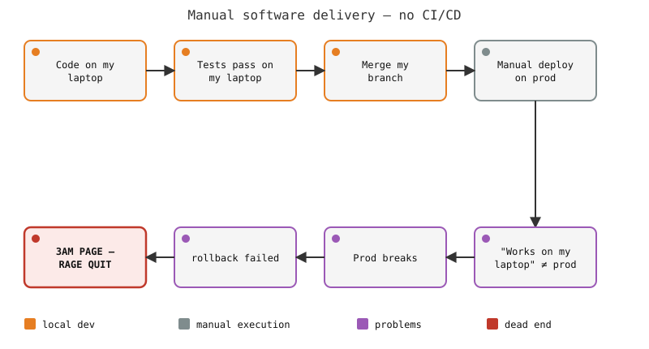
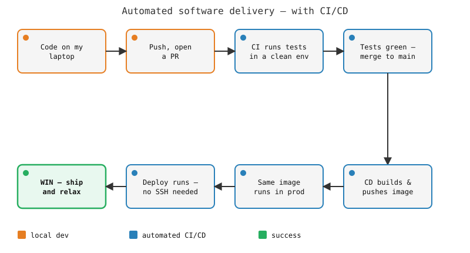

# 4. Workflow Control — GitHub Actions & CI/CD

Session 4 · 60 min · lecture + live demo only (no dedicated exercise slot —
see "Exercises" at the bottom)

## Prerequisites

* Git + GitHub account working (Session 1), Docker installed (Session 2)
* A personal scratch GitHub repo you can push to — everyone creates their
  own for the demo below, so create it now, empty:
  ```sh
  mkdir workflow-demo && cd workflow-demo && git init -b main
  ```
  (Pushed to GitHub as part of the demo. If you have the `gh` CLI:
  `gh repo create workflow-demo --public --source=. --push` does
  create-and-push in one command — not required, the web UI works too.)

## Objectives

* Explain what CI/CD automates, and why that matters on top of what Session 2 already gave you
* Use pixi's project-scoped, task-and-lockfile-native workflow well enough to reach for it going forward
* Write a GitHub Actions workflow that runs on every push
* Build and push a Docker image to GHCR automatically from CI
* Know devcontainers and Snakemake well enough to reach for them later — not build with them today

## Why automate?

Without automation, shipping software by hand looks like this — and
nothing stops it from happening again, the same way, on the next
release:



You've likely lived a smaller version of this already: **the demo
effect** — it works perfectly right up until you run it in front of an
audience, and then it doesn't. Same root cause as the diagram above —
"it ran here a minute ago" isn't the same claim as "it reliably runs,"
just with lower stakes than a production outage.

* Session 2 answered "what's my environment" — but a written-down
  `environment.yml` or `Dockerfile` only helps if someone actually uses
  it, every time, before merging
* Humans forget, skip steps under deadline pressure, or don't have a
  clean machine handy to test on — "works on my machine" strikes again,
  one layer up from Session 2, all the way through to production
* **DevOps**: treat "build, test, release, operate" as one continuous,
  shared responsibility, instead of "dev throws it over the wall, ops
  deals with it." The diagram above *is* the throw-over-the-wall version
  — every handoff is a manual step, so every handoff is where something
  breaks
* **CI/CD** is how DevOps gets implemented mechanically: **CI**
  (continuous integration: run the same checks, in the same clean
  environment, automatically, on every push — mandatory by construction,
  not by discipline) + **CD** (continuous delivery/deployment: extend
  that to *shipping* the result automatically — for us, pushing a built
  Docker image to a registry)

The rest of this session builds the automated replacement for the first
diagram — GitHub Actions standing in for the manual push, the SSH
session, and the hand-run deploy:



Same shape as the manual version, stage for stage — the difference is
every arrow after "push" runs itself.

## pixi: project-scoped, lockfile-native environments

Session 2 used Conda/Miniforge for the environment itself. pixi is a
newer conda-forge/PyPI package manager built around this session's exact
problem — making the environment reproducible *automatically*, not by
someone remembering to update `environment.yml`.

* **Env lives in the project, not `~/.conda/envs`** — `pixi.toml` sits
  next to your code, like `package.json`/`pyproject.toml`; `pixi run`
  finds it without you naming or activating anything. Conda envs are
  named and global by default — fine across projects, but nothing stops
  a `myproject` env silently drifting from what's actually written in
  `environment.yml`
* **Tasks** — `pixi.toml` can define named commands (`pixi run test`,
  `pixi run pipeline`), so everyone — and CI — runs the exact same
  invocation. This is workflow control as a *feature*: Conda has no
  equivalent, you'd reach for a Makefile or a README command table
  instead
* **Lockfile, always** — every `pixi add` updates `pixi.lock`, pinning
  every resolved package+build, meant to be committed. Conda can get
  this too, via `conda-lock` — but that's a separate tool and a separate
  step, easy to skip; pixi makes the lockfile the default, not an opt-in
* **Multi-platform in one file** — `pixi.lock` resolves and pins
  `linux-64`, `osx-arm64`, `win-64`, ... (including CUDA vs. CPU-only
  variants) from the same `pixi.toml`. Useful the moment your team isn't
  all on the same OS, or only some of you have a GPU — `environment.yml`
  doesn't express that; you'd hand-maintain separate files

```sh
pixi init astrolab -c conda-forge
cd astrolab
pixi add numpy matplotlib
pixi task add test "pytest"
pixi run test                  # everyone, and CI, run the same command
pixi run python -m astrolab.pipeline
```

## GitHub Actions, mechanics

GitHub Actions is where the CI/CD defined above actually runs — pixi
above keeps your *environment* reproducible; this section makes the
*checks on that environment* run automatically, on every push.

* A **workflow** = a YAML file in `.github/workflows/`, triggered by
  events: `on: push`, `on: pull_request`, `on: schedule`, ...
* A workflow has **jobs**; jobs run in parallel by default, each on a
  fresh **runner** (`ubuntu-latest`, ...) — no leftover state from a
  previous run, same isolation idea as Session 2's container point
* A job has **steps**: `uses:` runs a reusable, versioned action
  (someone else's packaged step — `actions/checkout`, ...), `run:` runs
  a shell command directly
* **Secrets**: `secrets.GITHUB_TOKEN` is auto-provisioned per run,
  scoped to that repo — no setup needed for the GHCR push below;
  project-specific secrets go in Settings → Secrets, never in a commit
  (Session 1's rule, now enforced by a UI instead of a `.gitignore`)
* The **Actions tab** on any repo shows every run, green or red, with
  full logs per step — this is what you'll watch in the demo

Minimal workflow:

```yaml
# .github/workflows/ci.yml
name: CI
on: [push, pull_request]

jobs:
  test:
    runs-on: ubuntu-latest
    steps:
      - uses: actions/checkout@v4
      - uses: actions/setup-python@v5
        with:
          python-version: "3.11"
      - run: python -m doctest main.py -v
```

## GHCR: picking back up from Session 2

Session 2 built a Docker image by hand, locally, and stopped there. A
second job, using two more actions, builds the *same* image and pushes
it to GitHub Container Registry on every push — no Docker CLI on your
machine required, no manually-run `docker push`:

```yaml
  docker:
    runs-on: ubuntu-latest
    needs: test              # only runs if the test job passed
    permissions:
      contents: read
      packages: write         # needed to push to GHCR
    steps:
      - uses: actions/checkout@v4
      - uses: docker/login-action@v3
        with:
          registry: ghcr.io
          username: ${{ github.actor }}
          password: ${{ secrets.GITHUB_TOKEN }}
      - uses: docker/build-push-action@v6
        with:
          context: .
          push: true
          tags: |
            ghcr.io/${{ github.repository }}:latest
            ghcr.io/${{ github.repository }}:${{ github.sha }}
```

* `needs: test` — a job dependency; the image only gets built and
  pushed if the tests pass first
* Two tags per push: `latest` (a moving pointer, convenient) and the
  commit SHA (immutable, so you can always point back at exactly what
  ran) — trades a little registry space for being able to answer "which
  code produced this image" months later
* If the push fails with a permissions error: Settings → Actions →
  General → "Workflow permissions" needs to allow read/write — some
  orgs default this to read-only

## Demo

Live, in the scratch repo from Prerequisites — not the data-challenge
repo, so nothing here collides with Session 2's environment/Dockerfile
exercises still waiting to be claimed tonight.

**1. Something small worth testing:**

```sh
cat > main.py <<'EOF'
def greet(name):
    """
    >>> greet("world")
    'Hello, world!'
    """
    return f"Hello, {name}!"

if __name__ == "__main__":
    print(greet("CI"))
EOF
git add main.py && git commit -m "Add greet()"
```

**2. Add the workflow, push, watch it run:**

```sh
mkdir -p .github/workflows
# paste the "Minimal workflow" YAML above into .github/workflows/ci.yml
git add .github/workflows/ci.yml
git commit -m "Add CI workflow"
git remote add origin git@github.com:<you>/workflow-demo.git   # if not using gh repo create
git push -u origin main
```

Open the repo's **Actions** tab on GitHub — a run starts within seconds,
turns green. Break it on purpose (typo the doctest), push again, watch
it turn red with the failure in the log — this is the payoff: nobody
had to remember to run this locally.

**3. Add the Docker job:**

```sh
cat > Dockerfile <<'EOF'
FROM python:3.11-slim
COPY main.py .
CMD ["python", "main.py"]
EOF
# append the "docker:" job from the GHCR section above into ci.yml
git add Dockerfile .github/workflows/ci.yml
git commit -m "Build and push image to GHCR"
git push
```

Watch the `docker` job run after `test` goes green. Once it finishes,
the repo's GitHub page → **Packages** (right sidebar) shows the pushed
image. Pull and run it from anywhere:

```sh
docker pull ghcr.io/<you>/workflow-demo:latest
docker run --rm ghcr.io/<you>/workflow-demo:latest
```

Same image, built by a runner you never logged into, from code you
pushed a minute ago. Keep the repo around or delete it after — it's
yours, it's not part of the data-challenge repo.

## Exercises

Backlog tasks for the data-challenge (see
`5-data-challenge/README.md`).

* **Add a GitHub Actions CI workflow to the data-challenge repo.** It
  currently has none. On every push and PR: check out, set up Python,
  install `numpy`/`matplotlib`/`pandas` (or `environment.yml` if Module
  2's exercise landed in your fork first — check), then run a real
  check — at minimum `python -c "from astrolab.io import
  load_frame_set; load_frame_set()"` (mirrors Session 2's demo: this
  part of the pipeline already works), and `pytest` too if a `test/` or
  `tests/` directory already exists in your fork (Module 3's exercises
  add one — may or may not have landed yet, depending on merge order).
  Split within the team: one person gets the workflow skeleton green on
  the smoke-check, another wires in `pytest` conditionally and confirms
  it doesn't fail the build when no tests exist yet, a third adds a
  status badge to `README.md` (Actions tab → workflow → "..." → Create
  status badge) and documents what the workflow checks.
* **Add a Docker build-and-push-to-GHCR job**, building on today's demo
  and Module 2's Dockerfile exercise. If your fork doesn't have a
  `Dockerfile` yet (Module 2's exercise wasn't claimed, or hasn't
  landed), add a minimal one first — same shape as today's demo, `COPY`
  the `astrolab/` package and `data/` instead of `main.py`. Push to
  `ghcr.io/<owner>/<repo>` on every push to `main`, tagged both `latest`
  and the commit SHA. Split within the team: one person wires
  `docker/login-action` + `docker/build-push-action` and gets a first
  image pushed, another sorts out the tagging strategy and the
  `permissions: packages: write` block, a third pulls the pushed image
  down and verifies `docker run` actually executes the pipeline
  correctly, then documents `docker pull`/`docker run` usage in
  `README.md`.

## Going further — from CI/CD to MLOps

* Everything above is *software* CI/CD: code in, tests out, image pushed.
  Data science / ML work adds two more moving parts plain CI/CD doesn't
  track — **datasets** and **experiment results** (metrics, plots, model
  weights) — both change independently of code, both need to stay in
  sync with the commit that produced them
* Without extra tooling, that sync happens by hand:

  

  Upload code, provision storage, upload data, spin up a runner, download
  it all back down, run the script, discover data and code have drifted,
  re-sync, discover the requirements changed too, have no good place to
  report results — loop. Same "works on my machine" problem this session
  opened with, one layer further out: now data and results are also out
  of sync, not just the environment
* **MLOps** is CI/CD's automation extended to also version data and
  report results automatically, instead of by hand:

  

  Code and data pushed together → CI/CD (GitHub Actions, same mechanics
  as above) provisions a runner (possibly GPU) → runs train/test → pushes
  metrics/plots back as PR comments, so a reviewer sees "does this change
  improve the model" the same way they see "do the tests pass"

* **Where to start, if you go there:**
  * **MLflow** — tracks experiments (params, metrics, artifacts) with
    little setup. Covers the "report results automatically" half of the
    picture above without changing how you store data — the quickest way
    in for most projects.
  * **DVC** — versions large datasets and pipeline stages outside Git,
    the other half of the picture. Real cost: another tool, another
    remote, a learning curve — worth paying once data genuinely doesn't
    fit in Git and needs the same rigor as code; not needed for small,
    synthetic, or otherwise-reproducible data (this course's `astrolab`
    frames, for instance).
  * Plenty of other tools cover pieces of this space (experiment
    tracking, pipeline orchestration, model registries, feature stores) —
    MLflow and DVC are a reasonable, well-documented pair to start from,
    not the only options.
