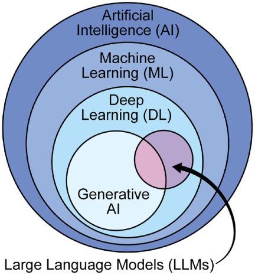
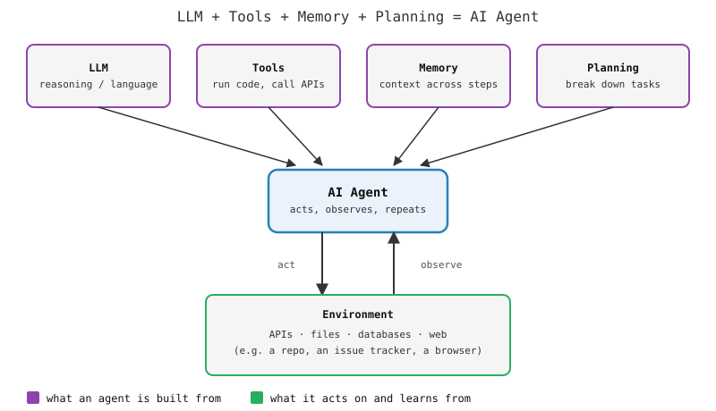

# (S)nap Talk — GitHub Copilot intro

30 min · lecture + live demo only (no lab time, no backlog exercises —
same treatment as [Session 1](../1-software-development-basics/); this
is a snap talk, not a numbered session)

## Objectives

* Know what an LLM and an AI agent actually are, well enough to reason
  about what Copilot can and can't do — not marketing vocabulary
* See GitHub Copilot used for real, at three levels of autonomy: inline
  chat/edit, agent mode in the editor, and an autonomous coding agent
  working from a GitHub issue
* See the "Memory" ingredient made concrete: an `AGENTS.md` file that
  encodes a project's conventions once so they persist across prompts,
  sessions, and human/agent contributors alike
* Carry one habit into [Session 3](../3-documentation-testing/) and the
  data challenge: AI output is a draft to review, not a verdict to trust

## Intro: define a few words before using them

Slide-deck style — just enough definition that "LLM" and "agent" aren't
mystery words for the rest of the talk.

### What is an LLM?

* **L**arge **L**anguage **M**odel
* A neural network trained on massive text corpora (books, articles,
  code, the web)
* Trained to predict the next word/token given context — an
  *autoregressive* model
* At sufficient scale, capabilities emerge that weren't explicitly
  programmed: reasoning, coding, problem-solving
* One model, many tasks: text generation, summarization, translation,
  code generation, ...



### What is an AI agent?

**LLM + Tools + Memory + Planning = AI agent**

* **Tools** — the agent can act on its environment: run code, call
  APIs, read/write files, search the web
* **Planning** — it can break a complex request into steps, not just
  answer in one shot
* **Memory** — it can carry context across steps, and sometimes across
  conversations or projects
* The loop: the agent **acts** on its environment, **observes** the
  result, and decides the next action — repeat until the task is done
  or it asks for help



## What is GitHub Copilot?

* An AI pair-programmer built into your editor and into GitHub itself
* Three levels of autonomy, all from the same underlying models —
  what changes is *how much you supervise each step*:
  1. **Inline completions / chat** — suggests as you type, answers
     questions, edits on request — you stay in the loop on every change
  2. **Agent mode (in VS Code)** — given a goal, it plans, edits
     multiple files, runs commands, iterates — you review the diff
     before it's committed
  3. **Autonomous coding agent (on GitHub)** — assign it an *issue*,
     it works in its own sandbox/branch and opens a PR — you review
     like any other contributor's PR

Same three levels this demo walks through, in order.

---

## Live demo: Orbital Mechanics Visualization

### Step 1 — create the repo, generate a first prototype

1. On GitHub: **New repository**
   * Name: `orbital-mechanics-visualization`
   * Description: *A simple tool to visualize orbital mechanics
     developed with GitHub Copilot*
  * Copilot prompt at the repo creation:

```
Create a simple web-based orbital mechanics visualization tool
using plain HTML, CSS, and vanilla JavaScript — no frameworks,
no build step.

Requirements:
- Single page, canvas-based 2D animation
- Simulate a 2-body system (a central star and one planet) under
  Newtonian gravity (F = G*m1*m2/r^2), using a simple numerical
  integrator (e.g. semi-implicit Euler)
- Sliders to adjust: mass of the central body, initial distance,
  initial orbital velocity — changing a slider restarts the
  simulation with the new values
- Add a GitHub Actions workflow that deploys the site to GitHub
  Pages on push to main

Keep it minimal and readable — this is a teaching demo, not
production code.
```
  * In repo settings: enable GitHub Pages on the `main` branch

3. Let it generate, accept the changes, commit, push. Watch the Pages
   deploy, open the live URL.

**Talking points**: this is agent mode already (plans, writes multiple
files, can run commands) — point out *what* it decided (file layout,
integrator choice) without you specifying it. This is where planning +
tools show up in practice, not just autocomplete.

### Aside — give Copilot persistent memory with `AGENTS.md`

The step 1 prompt set real ground rules — vanilla JS, no framework, no
build step, keep it minimal — but they lived in one chat message. Once
that conversation is gone, so are the rules; the next prompt (yours, a
teammate's, or an unsupervised agent's) has no way to know them unless
someone retypes them every time.

1. At the repo root, create `AGENTS.md`:

```markdown
# Project conventions

- Plain HTML, CSS, and vanilla JavaScript — no frameworks, no build step
- Single shared gravity integrator function — extend it for more bodies,
  don't fork it per feature
- Keep it minimal and readable — this is a teaching demo, not production
  code
```

2. Commit and push it straight to `main`.

**Talking points**: this is the "Memory" ingredient from the intro
diagram, made concrete — a plain Markdown file, not a special format,
and it's converging into a real cross-tool standard: GitHub Copilot's
coding agent reads it, so does Claude Code (as `CLAUDE.md`) and other
assistants (`.github/copilot-instructions.md` is GitHub Copilot's older,
repo-specific equivalent). It matters most for step 3: the autonomous
agent works with nobody in the room to ask, so `AGENTS.md` is the only
place it can pick up conventions nobody restated in that issue.

### Step 2 — Copilot in VS Code, extend to a 3-body system

1. clone the repo, open it in VS Code, `git switch -c feature/three-body` 
2. In Copilot Chat (agent mode), paste:

```
Extend the current 2-body simulation to a 3-body system: add a
second orbiting body with its own mass, initial distance, and
initial velocity sliders.

Update the physics integrator to sum gravitational forces from
both other bodies acting on each body (pairwise Newtonian
gravity). Keep the same rendering approach. Existing 2-body
behavior should still work if the second body's mass slider is
set to 0.
```

3. Review the diff, run it locally, confirm the 2-body case still
   works (mass slider at 0).
4. `git push -u origin feature/three-body`, open a PR.
5. In the PR: **Copilot code review** — request a review, walk through
   what it flags.

**Talking points**: this is the same loop as any PR (branch → push →
PR → review) — Copilot is a participant in that workflow, not a
replacement for it. This connects straight back to
[Session 1](../1-software-development-basics/)'s roles: Copilot review
comments are advisory, same as a human reviewer's — you still need a
human with merge rights (a maintainer) to actually merge. Also point
out what's *not* in this prompt: no need to restate "vanilla JS, no
framework" — that's already in `AGENTS.md` from the aside above, and
Copilot still respects it.

### Step 3 — assign a GitHub issue to the autonomous coding agent

1. Open a new issue on the repo:
   * Title: *Extend simulation to orbital motion of a small solar system*
   * Body:

```
Generalize the 2/3-body simulator into an N-body simulator that
can represent a small solar system (Sun + a handful of
planets).

- Reuse the existing pairwise-gravity integrator, generalized
  to N bodies instead of hard-coding 2 or 3
- Replace the fixed sliders with a simple list of bodies (name,
  mass, initial distance, initial velocity) that can be edited
  or added to
- Keep the existing rendering approach
- Update the README with how to add a new body
```
2. Assign the issue to **Copilot** (the coding agent) from the
   assignees panel.
3. Copilot works in the background (branch + sandbox); when it opens
   its PR, walk through: the PR description, the diff, its own commit
   history.
4. Review it live like the PR in step 2 — comment or request a change
   if something's off, then merge.

**Talking points**: same three ingredients as the intro diagram, now
end to end — the issue is the *plan* input, the sandboxed run is
*tools*, the PR is the *observable output* of the loop. And the same
review discipline from step 2 applies here too, more so: nobody in the
room wrote this code, so review it like a stranger's PR, not like your
own.

## The takeaway for the rest of the course

* Copilot (or any code assistant) removes the "no time to write
  tests/docs" excuse — see
  [Session 3](../3-documentation-testing/#conclusion-write-them-but-write-them-well)
* It does not remove the need to review — a generated diff, docstring,
  or test is a claim about behavior, not proof; you review it exactly
  like a teammate's PR, using the same roles and workflow from
  [Session 1](../1-software-development-basics/#roles-developer-reviewer-maintainer)
* Feel free to use it during the data challenge — the
  same "review before you trust it" rule applies there too
* **Today's example was chosen to be simple — real tasks usually
  aren't.** A real project's tasks are bigger and messier than "add a
  3-body extension." The general approach is the same one this course
  teaches for people: **split the work into pieces small enough for an
  agent to handle well** — same reasoning as sizing the data-challenge
  backlog for a team of 2–3

## Privacy is a real constraint

Copilot sees the code you point it at; on your own laptop, an assistant with broad tool access can see other data and documents too. Whether that's okay depends on your company's or project's policy, and on the data or code license — **check before you point an assistant at something you don't have the right to share.**

Alternatives exist when it's not:
* other LLM providers (including EU/France-hosted ones with specific
  privacy guarantees)
* a model running locally